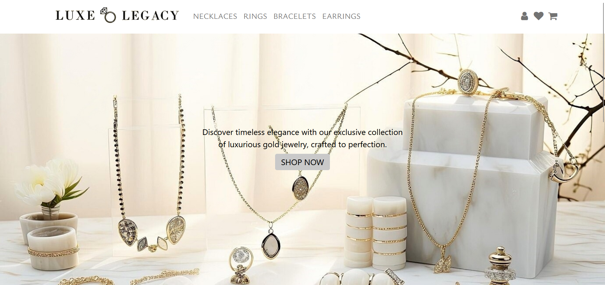
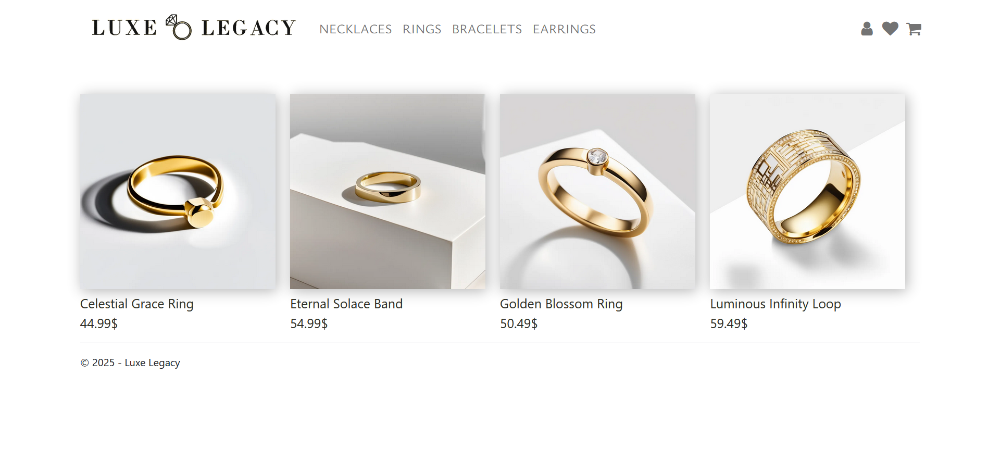
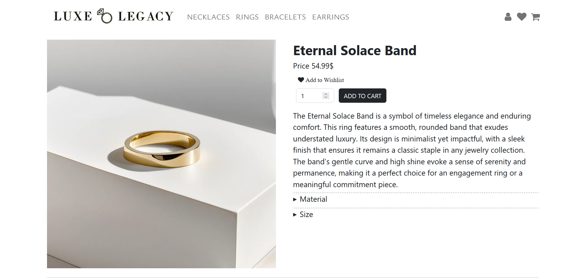
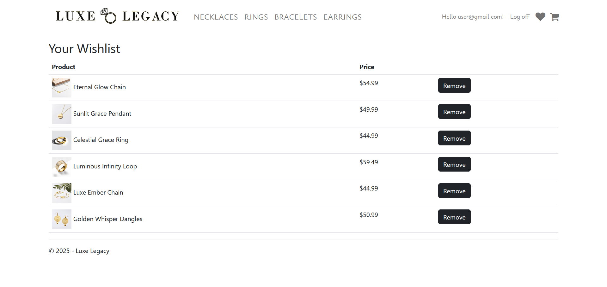
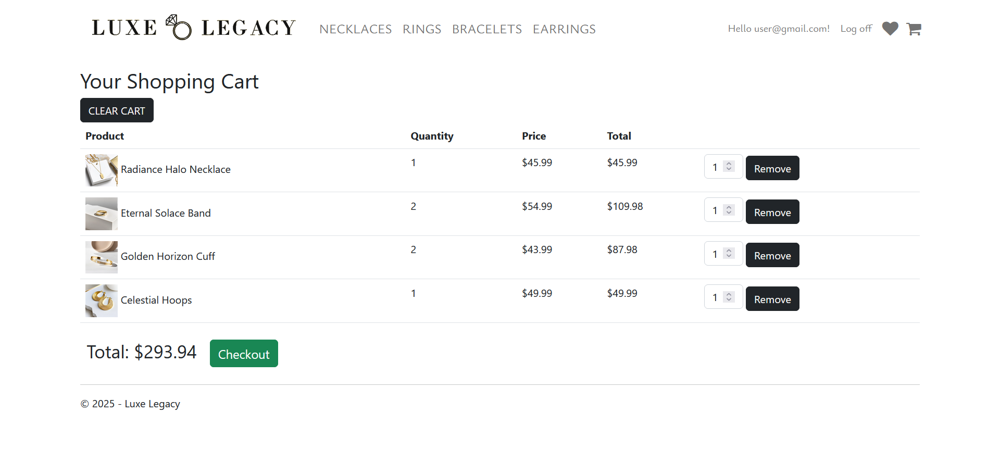

# LuxeLegacy

Project for the course Internet Technologies at FCSE

## Project Overview
Luxe Legacy is an ASP.NET e-commerce application featuring user authentication, a database-backed shopping cart, and wishlist functionality. 
Users can securely create accounts, browse products, add items to their shopping cart or wishlist, and complete purchases. 
The application integrates Entity Framework for database management and follows best practices for security and performance. It also provides a responsive, user-friendly interface for a smooth shopping experience.

## Features

- Authentication: User authentication and role-based access control.
- Database Integration: Uses Entity Framework for data management.
- Responsive UI: Built using Bootstrap for responsive design.
- MVC Architecture: Follows the Model-View-Controller pattern.

## Tech Stack

- ASP.NET 4.8
- Entity Framework
- SQL Server
- Bootstrap 4

## Images

